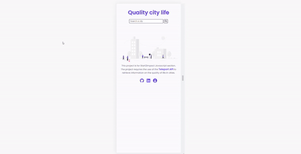

# Quality city life

This project was created for the complete JavaScript advanced section of Start2Impact.
 
You can watch the website [here](https://quality-life-city.netlify.app/).
 
 
It's my first time using :
- Webpack 5
- Fetch an api
- Axios
- Sass

## Project requests

- Fetch api from teleport with an input search
- Show these results:
  - The description of the city
  - The votes of the various categories
  - The colors of each category

